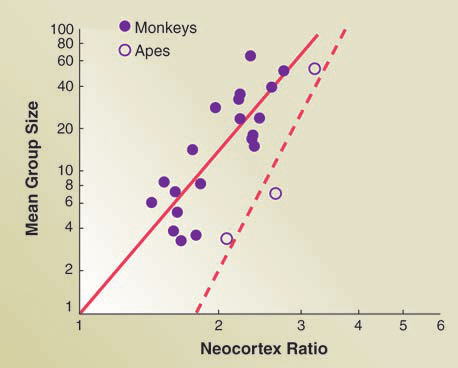
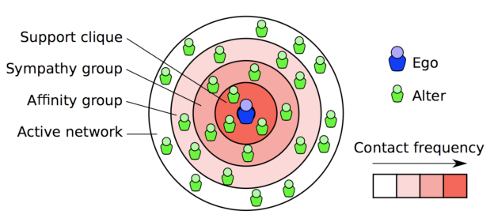
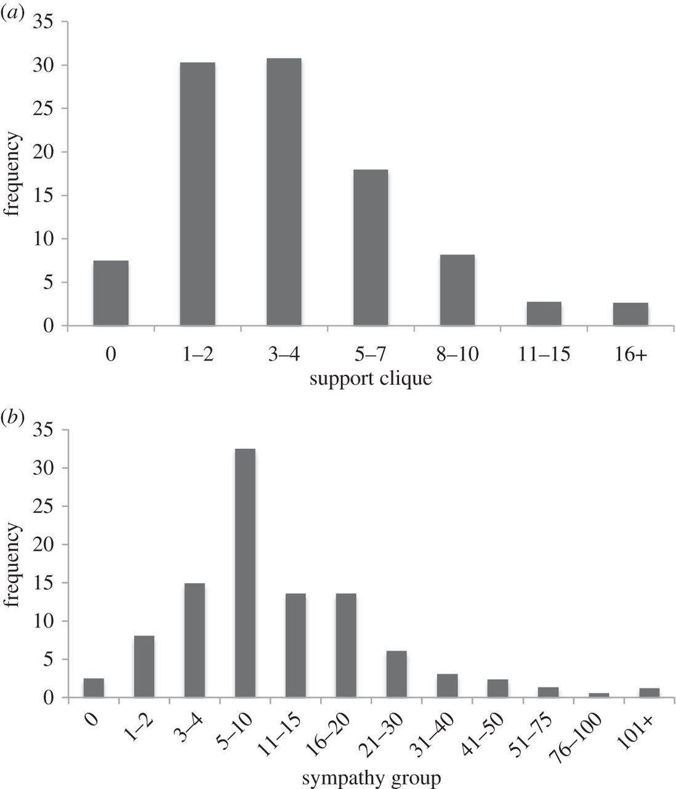
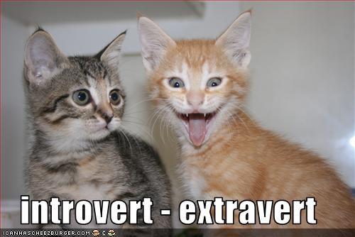
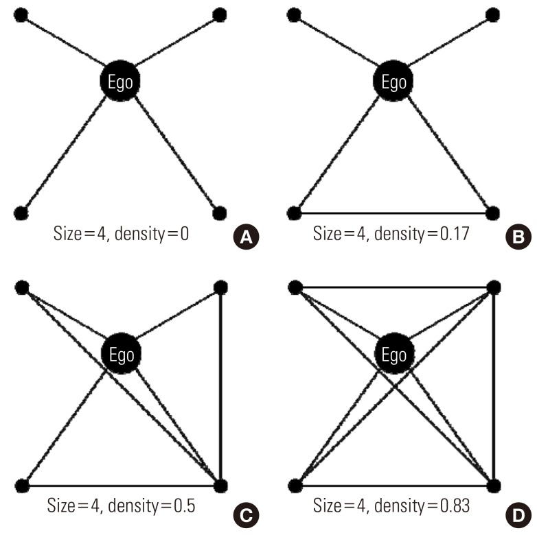

```{r setup, include=FALSE}
options(htmltools.dir.version = FALSE)
knitr::opts_chunk$set(echo = TRUE)
```

---
## Survey.

Please complete our survey:
<a href="http://gensi.cocolab.org" target="_blank">here</a>.!

Everybody can take part! 

Please carefully read the instructions. 

Please complete it individually.

Connor will be around if you run into problems.

```{r, out.width = "300px", echo=FALSE, fig.align='center'}
knitr::include_graphics("https://media.giphy.com/media/3oz8xIsloV7zOmt81G/giphy.gif") # giphy
```

---
## What did you just do?

* Personality questionnaire. (Introversion/Extraversion)

* Social network questionnaire.

* Loneliness questionnaire.

--

But:

```{r, out.width = "300px", echo=FALSE, fig.align='center'}
knitr::include_graphics("https://media.giphy.com/media/dILrAu24mU729pxPYN/giphy.gif") # giphy
```

---
## Let's take a big, big step back.

* Species vary in whether they are group-living or not.

--

* Our primate 'cousins'.

.pull-left[
```{r, out.width = "600px", echo=FALSE, fig.align='center'}
knitr::include_graphics("https://upload.wikimedia.org/wikipedia/commons/4/4d/Agilegibbon.jpg") # Julielangford [CC BY-SA 3.0 (https://creativecommons.org/licenses/by-sa/3.0)]
```
]
.pull-right[
```{r, out.width = "600px", echo=FALSE, fig.align='center'}
knitr::include_graphics("https://upload.wikimedia.org/wikipedia/commons/a/a5/Vervet_monkeys_grooming.JPG") # By The Rambling Man - Own work, CC BY-SA 3.0, https://commons.wikimedia.org/w/index.php?curid=32539550]
```
]

---
## Dunbar's Number.

* 'Natural' limits to the number of people we can know. **Time** + **Cognition**

--

* 150 number.

--

```{r, out.width = "500px", echo=FALSE, fig.align='center'}
 # Neocortex size, Dunbar & Shultz (2007)
```

---
## How do we know this (Dunbar 2008)?

* Anthropological / Archeological data. (Village sizes of Yanomami (Brazil/Venezuela), Aborginal Clans, Archeological findings)

--

* Religious communities (Hutterites)

--

* Social network studies / Surveys (e.g., Christmas cards, Hill & Dunbar, 2003)

--

--> 'applications': Goretex.

```{r, out.width = "300px", echo=FALSE, fig.align='center'}
knitr::include_graphics("https://upload.wikimedia.org/wikipedia/en/7/73/Thetippingpoint.jpg") # Fair use implied. copyright
```


---
## Social network: Not homogenous.

* Diagram by Barbara Guidi.
```{r, out.width = "600px", echo=FALSE, fig.align='center'}
 # Guidi, A distributed Dunbar-based Framework for Online Social Network
```

---
## Support clique / Sympathy group.

* Dunbar (2016) argues for +/- (max.) 5 for the support clique (support group) and around max. 15 for the sympathy group.

```{r, out.width = "400px", echo=FALSE, fig.align='center'}

```


---
## What does Personality have to do with this?

* Big 5 / Big 6 (HEXACO): Honesty/Humility - Emotionality - eXtraversion - Agreeableness - Conscientiousness - Openness to Experience.

--

* One dimension: Introversion/Extraversion.

--

* Stable individual differences.

--> Do people who are extraverted have more friends, also at these inner layers?

```{r, out.width = "300px", echo=FALSE, fig.align='center'}
 # I can has cheezburger.
```

---
## Previous research on Extraversion and 'offline' networks.

* Roberts et al. (2008) -  extraversion positively associated support group but not sympathy group size (N=168)

--

* Pollet et al. (2011) - extraversion positively associated support group, sympathy group size and outer layer (N=117)

--

* Molho et al. (2016) - extraversion positively associated with support group size but not sympathy group size. (N=525)


---
## Personality and Facebook networks.  

* Brown et al. (in preparation). - Extraversion associated with Facebook Network size (and number of clusters). No effects on Facebook structures

```{r, out.width = "400px", echo=FALSE, fig.align='center'}
knitr::include_graphics("https://media.giphy.com/media/xTiTnxM7bZ9200V2Eg/giphy.gif")
```

---
## Social network structure

--> These studies did not examine the *structure* of these layers. What you completed will allow us to look at this more closely.

Illustration by Lee et al. (2013)

```{r,  out.width = "400px", echo=FALSE, fig.align='center'}

# Social Network Characteristics and Body Mass Index in an Elderly Korean Population - Scientific Figure on ResearchGate. Available from: https://www.researchgate.net/figure/Personal-network-density-A-D-According-to-the-connections-among-friends-alters-it_fig1_259355548 [accessed 19 Feb, 2019]
```

---
## Final component: Loneliness (Russell et al. 1996)

* Emotional and social isolation. 

--

* Research shows that Introverts tend to report more loneliness (e.g., Saklofske & Yackulic, 1989) but we do not know how it relates to synthetic

---
## Why does this matter?

* Loneliness equivalent to smoking 15 cigarettes a day (Holt-Lunstad et al., 2010)

* National campaign to end loneliness.

* If we want to tackle loneliness, we need to understand it better.

---
## Example of research-led teaching.

* An example of Connor's research.

* You will conduct your own research in labs. For example, on body image, memory. Some of these will include surveys.

---
## Future work. Perhaps even your project?

* Does Instagram help to reduce loneliness?

* How do relationships form when people like yourself move to university? How do they relate to loneliness and living on vs. off campus?

* Loneliness in the elderly. Is it a matter of _any_ contact or specific contacts? Can we use Facetime/Skype to alleviate loneliness?

---
## Any Questions?

[http://tvpollet.github.io](http://tvpollet.github.io)

Twitter: @tvpollet

```{r, out.width = "600px", echo=FALSE, fig.align='center'}
knitr::include_graphics("https://media.giphy.com/media/3ohzdRoOp1FUYbtGDu/giphy.gif")
```

---
## References

